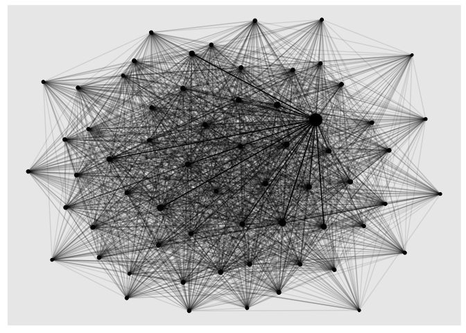
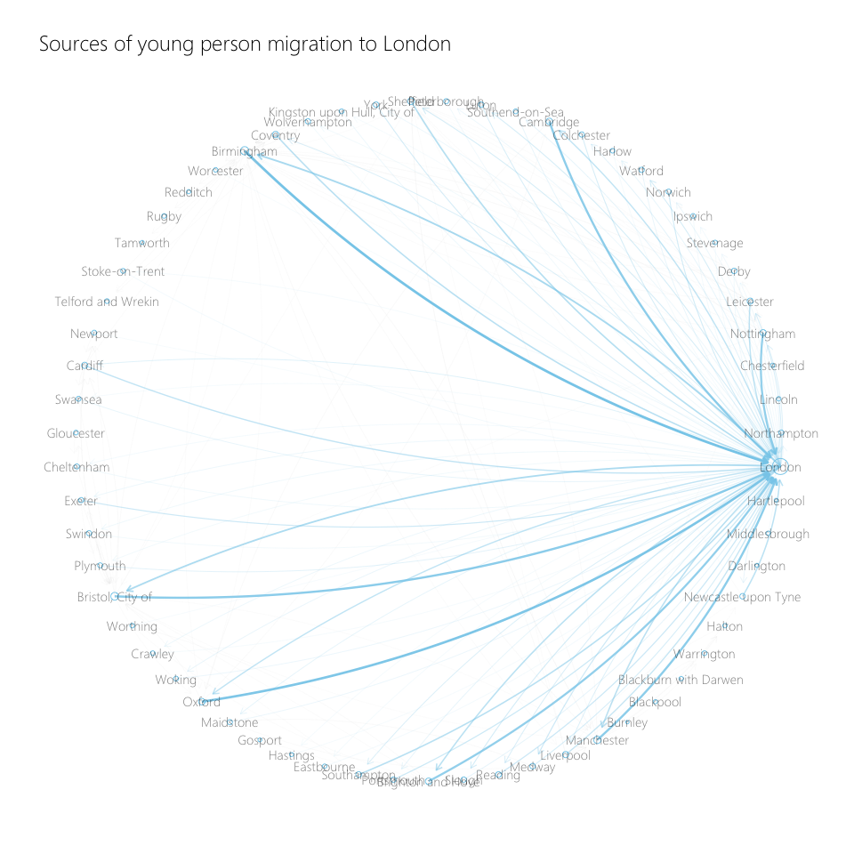
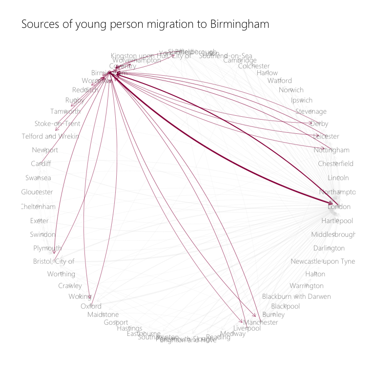
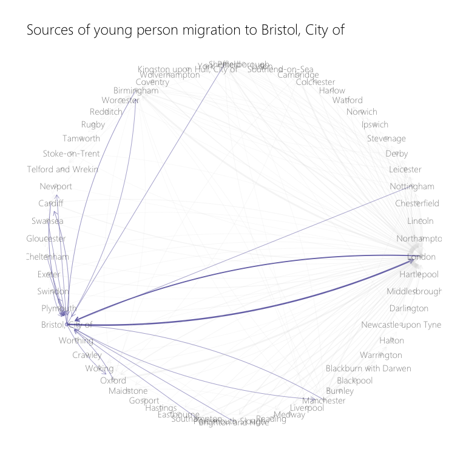
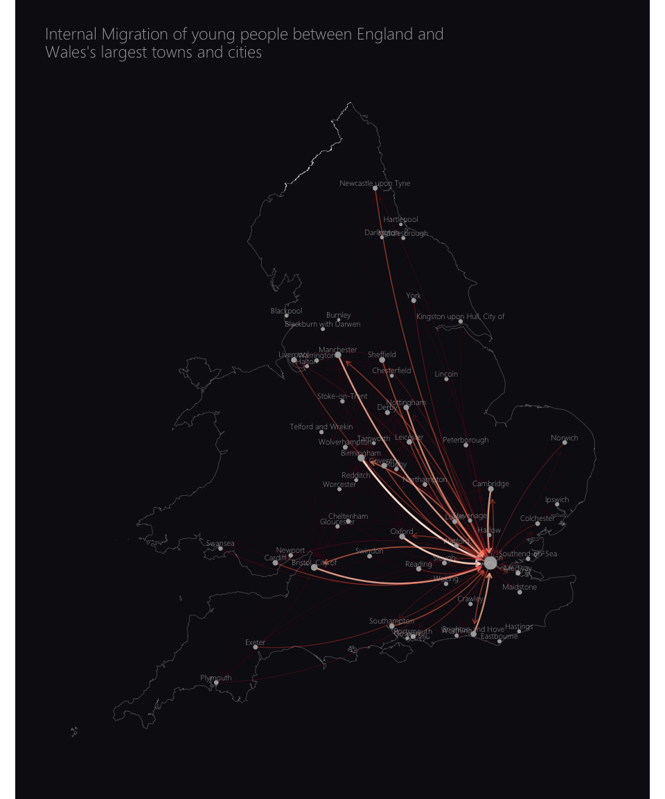
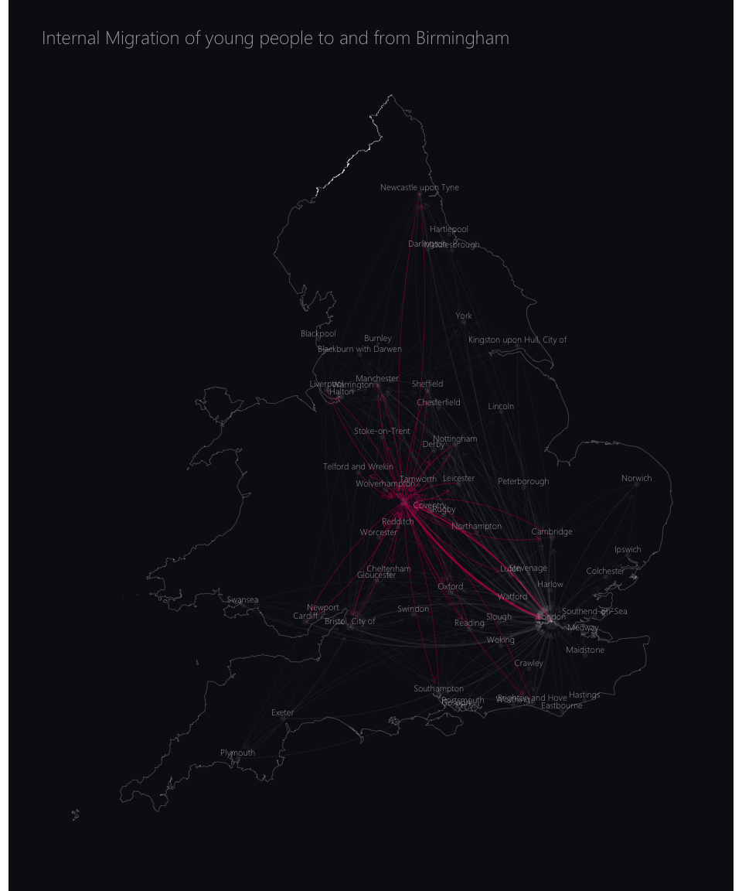
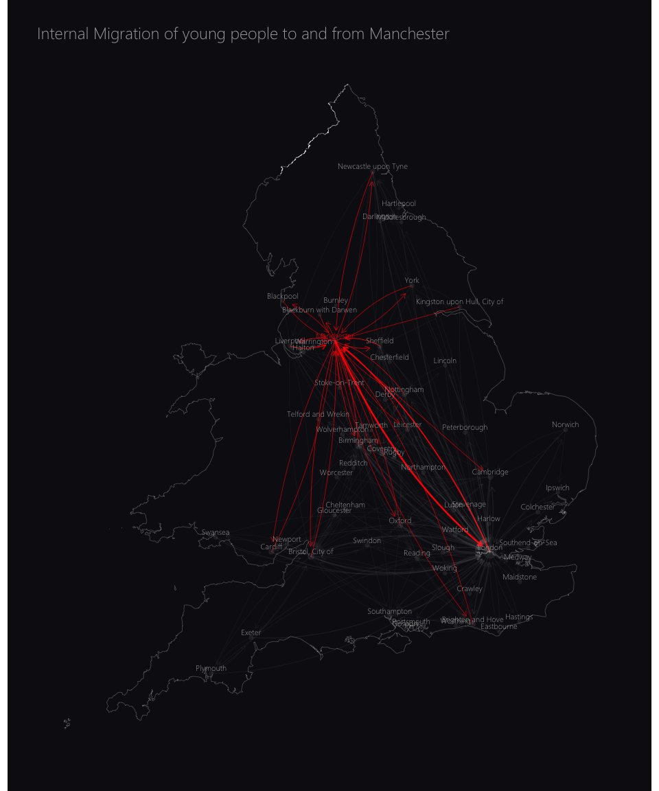
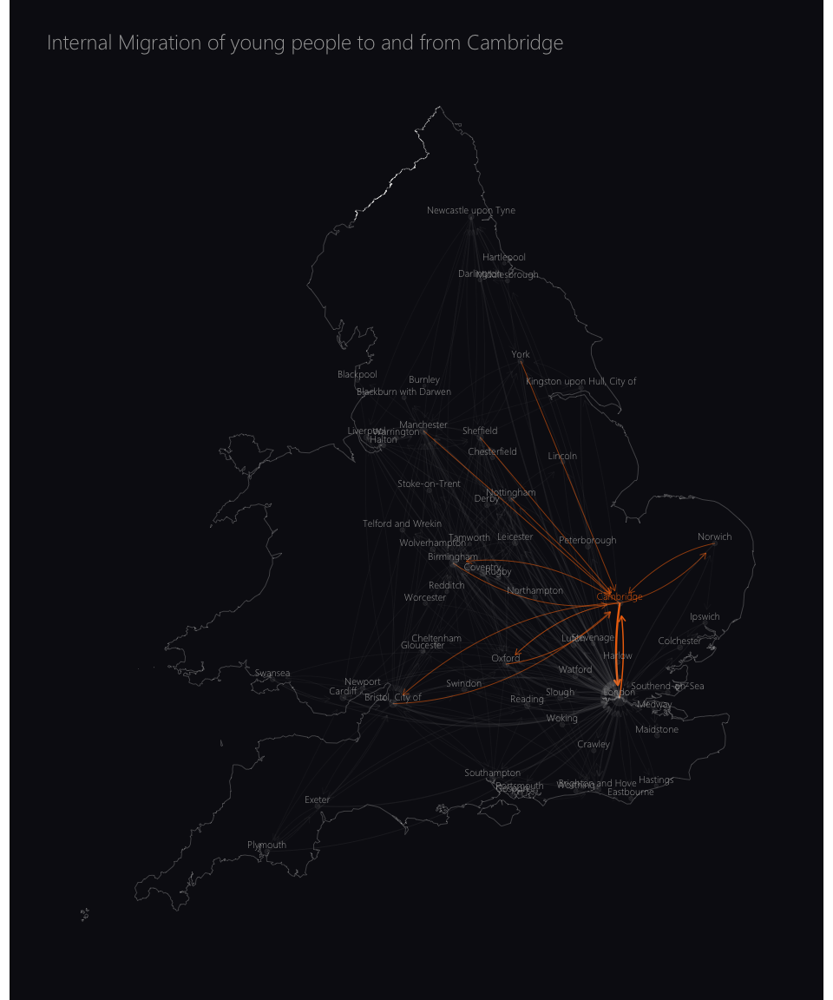
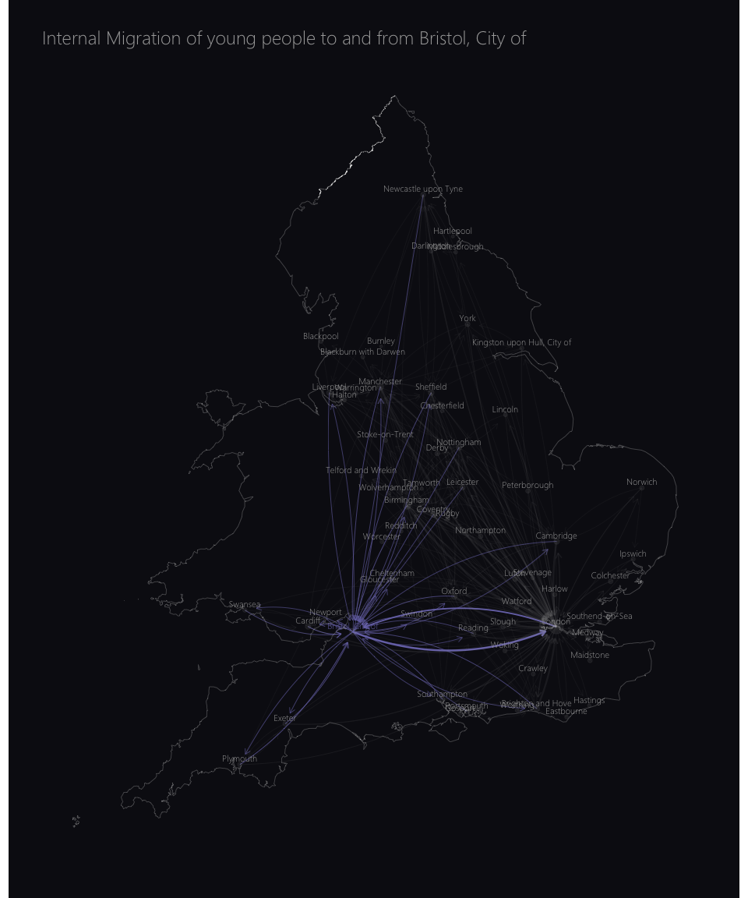
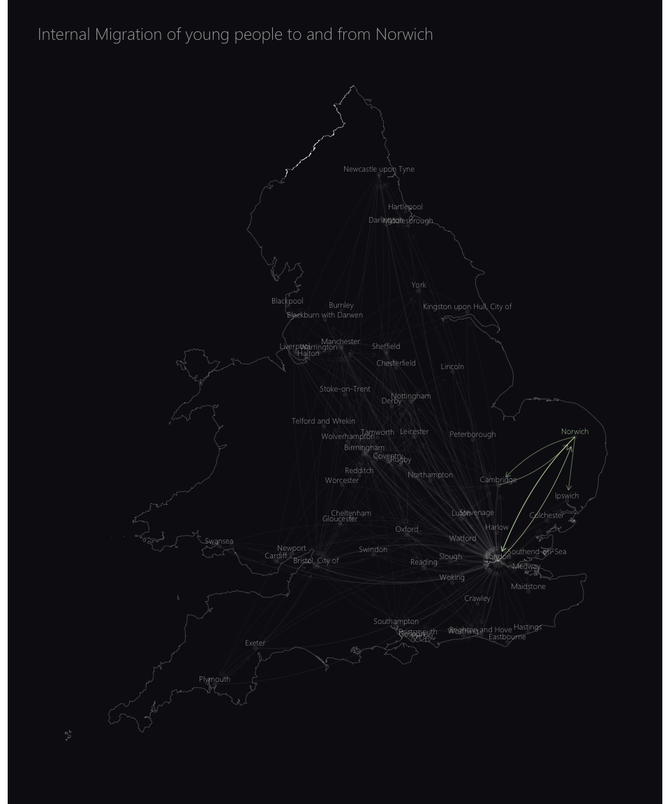

Exploring Internal Migration in the UK using ggraph
================

``` r
library(tidyverse)
```

    ## ── Attaching packages ─────────────────────────────────────────────────────────────────────────── tidyverse 1.3.0 ──

    ## ✔ ggplot2 3.2.1     ✔ purrr   0.3.3
    ## ✔ tibble  2.1.3     ✔ dplyr   0.8.3
    ## ✔ tidyr   1.0.0     ✔ stringr 1.4.0
    ## ✔ readr   1.3.1     ✔ forcats 0.4.0

    ## ── Conflicts ────────────────────────────────────────────────────────────────────────────── tidyverse_conflicts() ──
    ## ✖ dplyr::filter() masks stats::filter()
    ## ✖ dplyr::lag()    masks stats::lag()

### Reading in and preparing the data

``` r
migration <- data.table::fread("Detailed_Estimates_2018_Dataset_1_2019_LA_boundaries.csv") %>% 
  bind_rows(data.table::fread("Detailed_Estimates_2018_Dataset_2_2019_LA_boundaries.csv")) %>% 
  janitor::clean_names() %>% 
  # Counting total number of moves by age (including both genders) of both genders
  group_by(out_la, in_la, age) %>% 
  summarise(moves = sum(moves) %>% round(0)) %>% 
  ungroup()

migration
```

    ## # A tibble: 1,093,317 x 4
    ##    out_la    in_la       age moves
    ##    <chr>     <chr>     <int> <dbl>
    ##  1 E06000001 E06000002     0     1
    ##  2 E06000001 E06000002     1     1
    ##  3 E06000001 E06000002     2     4
    ##  4 E06000001 E06000002     3     4
    ##  5 E06000001 E06000002     5     6
    ##  6 E06000001 E06000002     6     4
    ##  7 E06000001 E06000002     7     1
    ##  8 E06000001 E06000002     8     4
    ##  9 E06000001 E06000002     9     3
    ## 10 E06000001 E06000002    10     1
    ## # … with 1,093,307 more rows

``` r
local_authority_codes <- 
  readxl::read_xlsx("lasregionew2018.xlsx", skip = 4) %>% 
  select("la_code" = 1, "la_name" = 2, "region" = 4)

london_codes <- local_authority_codes %>% filter(region == "London")
```

``` r
towns_and_cities <- read_csv("lauth-classification-csv.csv") %>% 
  filter(classification %in% c("Core City (London)", "Core City (outside London)", 
                               "Other City", "Large Town")) %>% 
  filter(percent_of_localauth > 0.7) %>% 
  distinct(localauth_code, localauth_name) %>% 
  rename("la_code" = localauth_code, "la_name" = localauth_name)
```

    ## Parsed with column specification:
    ## cols(
    ##   localauth_code = col_character(),
    ##   localauth_name = col_character(),
    ##   classification = col_character(),
    ##   population = col_double(),
    ##   percent_of_localauth = col_double()
    ## )

``` r
migration <- migration %>% 
  inner_join(local_authority_codes %>% select(la_code, la_name), by = c("in_la" = "la_code")) %>% 
  semi_join(towns_and_cities, by = c("in_la" = "la_code")) %>% 
  select(-in_la) %>% 
  rename("in_la" = la_name) %>% 
  inner_join(local_authority_codes %>% select(la_code, la_name), by = c("out_la" = "la_code")) %>% 
  semi_join(towns_and_cities, by = c("out_la" = "la_code")) %>% 
  select(-out_la) %>% 
  rename("out_la" = la_name) %>% 
  select(out_la, in_la, age, moves)
```

### Unifying all the London Boroughs

``` r
moves_to_london <- migration %>% 
  filter(in_la %in% london_codes$la_name) %>% 
  filter(!(out_la %in% london_codes$la_name)) %>% 
  group_by(out_la, age) %>% 
  summarise(moves = sum(moves)) %>% 
  mutate(in_la = "London")

moves_from_london <- migration %>% 
  filter(out_la %in% london_codes$la_name) %>% 
  filter(!(in_la %in% london_codes$la_name)) %>% 
  group_by(in_la, age) %>% 
  summarise(moves = sum(moves)) %>% 
  mutate(out_la = "London")

moves_london <- bind_rows(moves_to_london, moves_from_london)

migration <- migration %>% 
  filter(!(in_la %in% london_codes$la_name)) %>% 
  filter(!(out_la %in% london_codes$la_name)) %>% 
  bind_rows(moves_london)
```

### Exploring Migration Between the England’s urban areas

``` r
nodes <- migration %>% 
  select(out_la) %>% 
  distinct() %>% 
  rowid_to_column(var = "id") %>% 
  rename("city" = out_la)

edges <- migration %>% 
  group_by(out_la, in_la) %>% 
  filter(age %in% c(23:30)) %>% 
  summarise(moves = sum(moves)) %>% 
  ungroup() %>% 
  left_join(nodes, by = c("out_la" = "city")) %>% 
  rename("from" = id)

edges <- edges %>% 
  left_join(nodes, by = c("in_la" = "city")) %>% 
  rename("to" = id)

edges <- edges %>% select(from, to, moves)

moves_total <- edges %>% 
  group_by(to) %>% 
  summarise(total_moves = sum(moves)) %>% 
  ungroup()

nodes <- nodes %>% 
  left_join(moves_total, by = c("id" = "to")) %>% 
  left_join(local_authority_codes %>% select(la_name, region), by = c("city" = "la_name")) 

nodes[is.na(nodes$region),]$region <- "London"

nodes <- nodes %>% 
  arrange(region, id) %>% 
  mutate(city = fct_inorder(city))
```

``` r
library(ggraph)
library(igraph)
```

    ## 
    ## Attaching package: 'igraph'

    ## The following objects are masked from 'package:dplyr':
    ## 
    ##     as_data_frame, groups, union

    ## The following objects are masked from 'package:purrr':
    ## 
    ##     compose, simplify

    ## The following object is masked from 'package:tidyr':
    ## 
    ##     crossing

    ## The following object is masked from 'package:tibble':
    ## 
    ##     as_data_frame

    ## The following objects are masked from 'package:stats':
    ## 
    ##     decompose, spectrum

    ## The following object is masked from 'package:base':
    ## 
    ##     union

``` r
migration_net <- graph_from_data_frame(d = edges, vertices = nodes, directed = TRUE)

ggraph(migration_net, layout = 'kk') +
  geom_edge_link(aes(alpha = moves), show.legend = FALSE) + 
  geom_node_point(aes(size = total_moves), show.legend = FALSE) +
  scale_edge_width(range = c(0.2, 1)) 
```

<!-- -->

### Where contributes the most young people to London?

``` r
ldn_id <- nodes[nodes$city == "London", ]$id

migration_net_ldn <- graph_from_data_frame(d = edges %>% filter(to == ldn_id), vertices = nodes, directed = TRUE)

ggraph(migration_net_ldn, layout = 'linear') +
  geom_edge_arc(aes(alpha = moves, width = moves, col = moves), show.legend = FALSE) +
  geom_node_point(aes(size = total_moves), show.legend = FALSE, shape = 21) +
  geom_node_text(aes(label = city), hjust = -0.1, angle = 90, alpha = 0.5) + 
  scale_edge_width(range = c(0.2, 1)) +
  scale_edge_color_viridis() + 
  scale_fill_viridis() +
  theme_graph(border = FALSE)
```

<!-- -->

``` r
edges %>% 
  filter(moves > 100) %>% 
  mutate(london = if_else(to %in% ldn_id | from %in% ldn_id, TRUE, FALSE)) %>% 
  graph_from_data_frame(vertices = nodes, directed = TRUE) %>% 
  ggraph(layout = 'linear', circular = TRUE) +
  geom_edge_fan(aes(alpha = moves, col = london, width = moves), arrow = arrow(length = unit(2, "mm")), 
                end_cap = circle(4, "mm"), show.legend = FALSE) + 
  geom_node_point(aes(size = total_moves), shape = 21, show.legend = FALSE, col = "skyblue") + 
  geom_node_text(aes(label = city), alpha = 0.5, family = "Segoe UI Light") + 
  scale_alpha_continuous(range = c(0.1, 0.5)) + 
  scale_edge_width(range = c(0.2, 1)) + 
  scale_edge_color_manual(values = c("TRUE" = "skyblue", "FALSE" = "lightgrey")) +
  theme_graph(background = "white", base_family = "Segoe UI Light") + 
  labs(title = "Sources of young person migration to London")
```

<!-- -->

# What about other big towns and cities?

``` r
plot_migration <- function(city, color = "skyblue") {
  
  city_id <- nodes[nodes$city == city, ]$id
  
  nodes_city <- nodes %>% mutate(target_city = if_else(city_id == id, TRUE, FALSE))
  
  edges %>% 
    filter(moves > 100) %>% 
    mutate(city_to_from = if_else(to %in% city_id | from %in% city_id, TRUE, FALSE)) %>% 
    graph_from_data_frame(vertices = nodes_city, directed = TRUE) %>% 
    ggraph(layout = 'linear', circular = TRUE) +
    geom_edge_fan(aes(col = city_to_from, alpha = city_to_from, width = moves), 
                  arrow = arrow(length = unit(2, "mm")), 
                  end_cap = circle(4, "mm"), show.legend = FALSE) + 
    geom_node_point(aes(col = target_city), shape = 21, show.legend = FALSE) + 
    geom_node_text(aes(label = city), alpha = 0.5, family = "Segoe UI Light") + 
    scale_edge_width(range = c(0.2, 1)) + 
    scale_edge_alpha_discrete(range = c(0.2, 1)) + 
    scale_edge_color_manual(values = c("TRUE" = color, "FALSE" = "lightgrey")) +
    scale_color_manual(values = c("TRUE" = color, "FALSE" = "lightgrey")) +
    theme_graph(background = "white", base_family = "Segoe UI Light") + 
    labs(title = paste0("Sources of young person migration to ", city))
}

plot_migration("Manchester", color = "red")
```

<!-- -->

``` r
plot_migration(city = "Birmingham", color = "#9A054A")
```

<!-- -->

``` r
plot_migration("Cambridge", color = "#ED700A")
```

<!-- -->

``` r
plot_migration("Bristol, City of", color = "#7874B5")
```

<!-- -->

``` r
migration_net <- graph_from_data_frame(d = edges %>% filter(moves > 100), vertices = nodes, directed = TRUE)

ggraph(migration_net, layout = "kk") +
  geom_edge_fan(aes(alpha = moves), arrow = arrow(length = unit(2, "mm")), 
                end_cap = circle(4, "mm"), show.legend = FALSE) + 
  geom_node_point(shape = 21) + 
  scale_edge_width(range = c(0.2, 1)) +
  geom_node_text(aes(label = city), alpha = 0.5, family = "Segoe UI Light") +
  labs(title = "Migration of young people between England and Wales' largest towns and cities") +
  theme_graph(border = FALSE, title_family = "Segoe UI Light")
```

<!-- -->

``` r
manchester_id <- nodes[nodes$city == "Manchester",]$id 

edges %>% 
  filter(moves > 100) %>% 
  mutate(manchester = if_else(to %in% manchester_id | from %in% manchester_id, TRUE, FALSE)) %>% 
  graph_from_data_frame(vertices = nodes, directed = TRUE) %>%  
  ggraph(layout = 'kk') +
  geom_edge_fan(aes(alpha = manchester, col = manchester, width = moves), 
                arrow = arrow(length = unit(2, "mm")), 
                end_cap = circle(4, "mm"), show.legend = FALSE) + 
  geom_node_point(aes(col = city == "Manchester"), shape = 21, show.legend = FALSE) + 
  geom_node_text(aes(label = city), alpha = 0.5, family = "Segoe UI Light") + 
  scale_edge_alpha_discrete(range = c(0.2, 0.8)) + 
  scale_edge_width(range = c(0.4, 1)) + 
  scale_edge_color_manual(values = c("TRUE" = "red", "FALSE" = "lightgrey")) +
  scale_color_manual(values = c("TRUE" = "red", "FALSE" = "lightgrey")) +
  theme_graph(background = "white", base_family = "Segoe UI Light") + 
  labs(title = "Migration flows of young persons to and from Manchester in 2018")
```

<!-- -->

``` r
migration_intra_region <- migration %>% 
  left_join(local_authority_codes %>% select("out_la" = la_name, "out_region" = region)) %>% 
  left_join(local_authority_codes %>% select("in_la" = la_name, "in_region" = region)) %>% 
  filter(!is.na(out_region)) %>% # Removes London
  filter(out_region == in_region) %>% 
  filter(age %in% c(23:30)) %>% 
  group_by(out_la, in_la, out_region, in_region) %>% 
  summarise(moves = sum(moves)) %>% 
  ungroup() 
```

    ## Joining, by = "out_la"Joining, by = "in_la"

``` r
nodes <- migration_intra_region %>% 
  select(out_la, out_region) %>% 
  distinct() %>% 
  rowid_to_column(var = "id") %>% 
  rename("city" = out_la, "region" = out_region)

edges <- migration_intra_region %>% 
  left_join(nodes, by = c("out_la" = "city")) %>% 
  rename("from" = id)

edges <- edges %>% 
  left_join(nodes %>% rename("in_la" = city, "in_region" = region)) %>% 
  rename("to" = id)
```

    ## Joining, by = c("in_la", "in_region")

``` r
edges <- edges %>% select(from, to, moves)
```

``` r
migration_intra_region_network <- graph_from_data_frame(d = edges %>% filter(moves > 50), 
                                                        vertices = nodes, directed = TRUE)

ggraph(migration_intra_region_network, layout = 'kk') +
  geom_edge_fan(aes(alpha = moves), 
                arrow = arrow(length = unit(2, "mm")), 
                end_cap = circle(2, "mm"), 
                show.legend = FALSE) + 
  geom_node_point(show.legend = FALSE) +
  geom_node_text(aes(label = city)) + 
  scale_edge_width(range = c(0.1, 5)) + 
  facet_nodes(~region, scales = "free", ncol = 2) 
```

<!-- -->

``` r
library(sf)
```

    ## Linking to GEOS 3.6.1, GDAL 2.1.3, PROJ 4.9.3

``` r
uk_map <- read_sf("uk map", 
                  "Local_Authority_Districts_December_2017_Full_Clipped_Boundaries_in_Great_Britain") %>% 
  select("la_code" = 2, "la_name" = 3) %>% 
  st_transform(crs = 4326) 

cities_coords <- semi_join(uk_map, towns_and_cities, by = "la_code") %>% st_centroid(uk_map) 
```

    ## Warning in st_centroid.sf(., uk_map): st_centroid assumes attributes are
    ## constant over geometries of x

    ## Warning in st_centroid.sfc(st_geometry(x), of_largest_polygon =
    ## of_largest_polygon): st_centroid does not give correct centroids for
    ## longitude/latitude data

``` r
cities_coords <- cities_coords %>% 
  mutate(long = st_coordinates(.)[,1], 
         lat = st_coordinates(.)[,2]) %>% 
  as.data.frame() %>% 
  select(-geometry) %>% 
  as_tibble()
```

``` r
uk_map_outline <- read_sf("uk map", "NUTS_Level_1_January_2018_Ultra_Generalised_Clipped_Boundaries_in_the_United_Kingdom") %>% 
  st_transform(crs = 4326) %>% 
  filter(!(nuts118nm %in% c("Scotland", "Northern Ireland"))) %>% 
  st_union() 
```

``` r
nodes <- migration %>% 
  select(out_la) %>% 
  distinct() %>% 
  rowid_to_column(var = "id") %>% 
  rename("city" = out_la)

edges <- migration %>% 
  group_by(out_la, in_la) %>% 
  filter(age %in% c(23:30)) %>% 
  summarise(moves = sum(moves)) %>% 
  ungroup() %>% 
  left_join(nodes, by = c("out_la" = "city")) %>% 
  rename("from" = id)

edges <- edges %>% 
  left_join(nodes, by = c("in_la" = "city")) %>% 
  rename("to" = id)

edges <- edges %>% select(from, to, moves)

cities_coords <- cities_coords %>% 
  right_join(nodes, by = c("la_name" = "city")) %>% 
  select(-la_code)

cities_coords[cities_coords$la_name == "London",]$long <- 0.1278
cities_coords[cities_coords$la_name == "London",]$lat <- 51.5074

moves_total <- edges %>% 
  group_by(to) %>% 
  summarise(total_moves = sum(moves)) %>% 
  ungroup() %>% 
  rename("id" = to)

nodes <- nodes %>% left_join(moves_total, by = "id")
```

``` r
migration_coords <- graph_from_data_frame(d = edges %>% filter(moves > 50), vertices = nodes, directed = TRUE)

migration_coords <- create_layout(migration_coords, 
              layout = bind_cols(list("x" = cities_coords$long, "y" = cities_coords$lat)))

ggraph(migration_coords) + 
  geom_edge_fan(aes(alpha = moves, width = moves, col = moves), arrow = arrow(length = unit(2, "mm")), 
                end_cap = circle(4, "mm"), show.legend = FALSE) + 
  geom_node_point(aes(size = total_moves), col = "darkgrey", show.legend = FALSE) + 
  geom_node_text(aes(label = city), vjust = -0.5, family = "Segoe UI Light", 
                 size = 3, color = "darkgrey") + 
  scale_alpha_continuous(range = c(0.1, 0.5)) + 
  scale_edge_width(range = c(0.2, 1)) + 
  scale_edge_color_distiller(palette = "Reds") +
  geom_sf(data = uk_map_outline, fill = NA, col = "lightgrey", size = 0.1) + 
  labs(title = "Internal Migration of young people between England and \nWales's largest towns and cities") +
  theme_graph(border = FALSE, title_family = "Segoe UI Light", 
              title_colour = "darkgrey",
              background = "#0E0E16")
```

<!-- -->

``` r
plot_migration_map <- function(city, color = "skyblue"){
  
  city_id <- nodes[nodes$city == city,]$id
  
  edges <- edges %>% mutate(is_city = to %in% city_id | from %in% city_id)
  nodes <- nodes %>% mutate(is_city = id == city_id)
  
  migration_coords <- graph_from_data_frame(d = edges %>% filter(moves > 50), vertices = nodes, directed = TRUE)
  
  migration_coords <- create_layout(migration_coords, 
                                    layout = bind_cols(list("x" = cities_coords$long, "y" = cities_coords$lat)))
  
  ggraph(migration_coords) + 
    geom_edge_fan(aes(width = moves, col = is_city == TRUE, alpha = is_city),
                  arrow = arrow(length = unit(2, "mm")), 
                  end_cap = circle(4, "mm"), show.legend = FALSE) + 
    geom_node_point(aes(size = total_moves), col = "darkgrey", alpha = 0.1, show.legend = FALSE) +
    geom_node_text(aes(label = city, color = is_city), vjust = -0.5, family = "Segoe UI Light", 
                 size = 3, show.legend = FALSE) + 
    scale_color_manual(values = c("TRUE" = color, "FALSE" = "darkgrey")) +
    scale_edge_width(range = c(0.2, 1)) + 
    scale_edge_alpha_discrete(range = c(0.1, 4)) + 
    scale_edge_color_manual(values = c("TRUE" = color, "FALSE" = "darkgrey")) + 
    geom_sf(data = uk_map_outline, fill = NA, col = "lightgrey", size = 0.1) + 
    labs(title = paste0("Internal Migration of young people to and from ", city)) +
    theme_graph(border = FALSE, title_family = "Segoe UI Light", 
                title_colour = "darkgrey",
                background = "#0E0E16")
  
}

plot_migration_map(city = "Birmingham", color = "#9A054A")
```

<!-- -->

``` r
plot_migration_map("Manchester", color = "red")
```

<!-- -->

``` r
plot_migration_map("Cambridge", color = "#ED700A")
```

<!-- -->

``` r
plot_migration_map("Bristol, City of", color = "#7874B5")
```

<!-- -->

``` r
plot_migration_map("Norwich", color = "#BBCEA4")
```

<!-- -->
